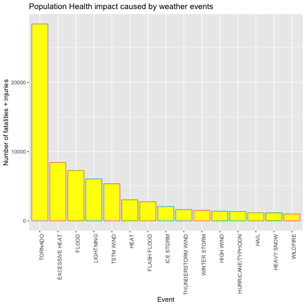
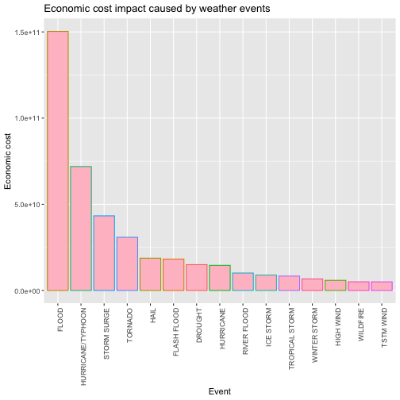

### Synopsis
Based on the weather events data that was provided, top health impacting weather events and the top economy impacting weather events have been determined. Two graphs have been plotted to provide a better picture. It was found that TORNADO had the biggest health impact while FLOOD had the biggest economic impact.

### Importing libraries

```r
library(ggplot2)
library(dplyr)
```

```
## 
## Attaching package: 'dplyr'
```

```
## The following objects are masked from 'package:stats':
## 
##     filter, lag
```

```
## The following objects are masked from 'package:base':
## 
##     intersect, setdiff, setequal, union
```

```r
library(lubridate)
```

```
## 
## Attaching package: 'lubridate'
```

```
## The following objects are masked from 'package:dplyr':
## 
##     intersect, setdiff, union
```

```
## The following objects are masked from 'package:base':
## 
##     date, intersect, setdiff, union
```
### Data Processing
If "storm" doesn't exist, then we read the csv file for our data

```r
if(!exists("storm")){
  storm <- read.csv(bzfile("repdata_data_StormData.csv.bz2"),header = TRUE)
}
```
"storm" has 902297 rows and 37 columns. Since data recorded in the earlier years is not reliable, we will use data from only the recent years for our analysis, i.e., 1990 to 2011

Introducing a "Year" column so that the new subset can be created

```r
storm$BGN_DATE <- as.Date(storm$BGN_DATE, "%m/%d/%Y")
storm$Year <- year(storm$BGN_DATE)
```
Creating our new 1990-2011 storm data subset

```r
newStorm <- storm[storm$Year>=1990,]
```
So now we have 751740 rows and 38 columns of new data

Since the first question is to find the events that are most harmful to population health, we will check for the most number of "fatalities" and "injuries". But since we are looking at their impact together, we can group "fatalities" and "injuries" into one term "pophealth"

```r
newStorm <- mutate(newStorm,POPHEALTH = FATALITIES+INJURIES)
newStorm$EVTYPE <- toupper(newStorm$EVTYPE)
```
Now we look at events that were the most harmful to population health

```r
healthImpact <- with(newStorm,aggregate(POPHEALTH~EVTYPE,FUN=sum))
subset(healthImpact,POPHEALTH>quantile(POPHEALTH,prob=0.95))
```

```
##                      EVTYPE POPHEALTH
## 19                AVALANCHE       394
## 28                 BLIZZARD       906
## 69          COLD/WIND CHILL       107
## 78                DENSE FOG       360
## 105              DUST STORM       462
## 116          EXCESSIVE HEAT      8428
## 125            EXTREME COLD       393
## 126 EXTREME COLD/WIND CHILL       149
## 127            EXTREME HEAT       251
## 138             FLASH FLOOD      2755
## 154                   FLOOD      7259
## 171                     FOG       796
## 195                   GLAZE       223
## 212                    HAIL      1154
## 243                    HEAT      3037
## 245               HEAT WAVE       551
## 254              HEAVY RAIN       349
## 274              HEAVY SNOW      1148
## 312               HIGH SURF       260
## 320               HIGH WIND      1385
## 337              HIGH WINDS       337
## 363               HURRICANE       107
## 372       HURRICANE/TYPHOON      1339
## 377                     ICE       143
## 387               ICE STORM      2064
## 418               LIGHTNING      6046
## 524             RIP CURRENT       600
## 525            RIP CURRENTS       501
## 604             STRONG WIND       383
## 685       THUNDERSTORM WIND      1621
## 711      THUNDERSTORM WINDS       972
## 758                 TORNADO     28426
## 772          TROPICAL STORM       398
## 779               TSTM WIND      5349
## 796          TSTM WIND/HAIL       100
## 800                 TSUNAMI       162
## 839    URBAN/SML STREAM FLD       107
## 872              WILD FIRES       153
## 873        WILD/FOREST FIRE       557
## 875                WILDFIRE       986
## 877                    WIND       109
## 888            WINTER STORM      1527
## 893          WINTER WEATHER       431
## 895      WINTER WEATHER/MIX       100
```

```r
healthImpact <- newStorm %>% 
  group_by(EVTYPE) %>% 
  summarise(POPHEALTH = sum(POPHEALTH)) %>% 
  arrange(desc(POPHEALTH))
```
Therefore now we have healthImpact that contains all the EVTYPEs listed in decreasing order based on their total population health impact. 
head(healthImpact) would give the following:

EVTYPE         POPHEALTH
1 TORNADO            28426
2 EXCESSIVE HEAT      8428
3 FLOOD               7259
4 LIGHTNING           6046
5 TSTM WIND           5349
6 HEAT                3037

So we see that the most harmful EVTYPE to population health from 1990-2011 was TORNADO followed by EXCESSIVE HEAT, FLOOD, and so on 
A plot of EVTYPEs v/s health impact of the top 15 EVTYPEs would provide a better picture

```r
a <- ggplot(healthImpact[1:15,], aes(x=reorder(EVTYPE, -POPHEALTH),y=POPHEALTH,color=EVTYPE)) + 
  geom_bar(stat="identity", fill="yellow") + 
  theme(axis.text.x = element_text(angle = 90, hjust = 1)) + 
  xlab("Event") + ylab("Number of fatalities + injuries") +
  theme(legend.position="none") +
  ggtitle("Population Health impact caused by weather events")
a
```


From the graph it is visible that TORNADO had by far the most impact, almost 3 times more than the second most harmful event

### Economic Impact
Now we move on to analyse the economic impact these weather events had in the US from 1990-2011
In addition to PROPDMG and CROPDMG, their exponents PROPDMGEXP and CROPDMGEXP have also been recorded

```r
newStorm$PROPDMGEXP <- toupper(newStorm$PROPDMGEXP)
newStorm$CROPDMGEXP <- toupper(newStorm$CROPDMGEXP)
newStorm$CROPDMGFACTOR[(newStorm$CROPDMGEXP == "")] <- 10^0
newStorm$CROPDMGFACTOR[(newStorm$CROPDMGEXP == "?")] <- 10^0
newStorm$CROPDMGFACTOR[(newStorm$CROPDMGEXP == "0")] <- 10^0
newStorm$CROPDMGFACTOR[(newStorm$CROPDMGEXP == "2")] <- 10^2
newStorm$CROPDMGFACTOR[(newStorm$CROPDMGEXP == "K")] <- 10^3
newStorm$CROPDMGFACTOR[(newStorm$CROPDMGEXP == "M")] <- 10^6
newStorm$CROPDMGFACTOR[(newStorm$CROPDMGEXP == "B")] <- 10^9
newStorm$PROPDMGFACTOR[(newStorm$PROPDMGEXP == "")] <- 10^0
newStorm$PROPDMGFACTOR[(newStorm$PROPDMGEXP == "-")] <- 10^0
newStorm$PROPDMGFACTOR[(newStorm$PROPDMGEXP == "?")] <- 10^0
newStorm$PROPDMGFACTOR[(newStorm$PROPDMGEXP == "+")] <- 10^0
newStorm$PROPDMGFACTOR[(newStorm$PROPDMGEXP == "0")] <- 10^0
newStorm$PROPDMGFACTOR[(newStorm$PROPDMGEXP == "1")] <- 10^1
newStorm$PROPDMGFACTOR[(newStorm$PROPDMGEXP == "2")] <- 10^2
newStorm$PROPDMGFACTOR[(newStorm$PROPDMGEXP == "3")] <- 10^3
newStorm$PROPDMGFACTOR[(newStorm$PROPDMGEXP == "4")] <- 10^4
newStorm$PROPDMGFACTOR[(newStorm$PROPDMGEXP == "5")] <- 10^5
newStorm$PROPDMGFACTOR[(newStorm$PROPDMGEXP == "6")] <- 10^6
newStorm$PROPDMGFACTOR[(newStorm$PROPDMGEXP == "7")] <- 10^7
newStorm$PROPDMGFACTOR[(newStorm$PROPDMGEXP == "8")] <- 10^8
newStorm$PROPDMGFACTOR[(newStorm$PROPDMGEXP == "H")] <- 10^2
newStorm$PROPDMGFACTOR[(newStorm$PROPDMGEXP == "K")] <- 10^3
newStorm$PROPDMGFACTOR[(newStorm$PROPDMGEXP == "M")] <- 10^6
newStorm$PROPDMGFACTOR[(newStorm$PROPDMGEXP == "B")] <- 10^9
```
Now we multiply the damages with their corresponding exponents and use a single term to capture their collective contribution

```r
newStorm <- mutate(newStorm, ECONOMICCOST = PROPDMG * PROPDMGFACTOR + CROPDMG * CROPDMGFACTOR)
```
Using the same process we adopted to find the most harmful events for population health impact, we shall find the most harmful events for economic impact

```r
ecoCost <- with(newStorm, aggregate(ECONOMICCOST ~ EVTYPE, FUN = sum))
subset(ecoCost, ECONOMICCOST > quantile(ECONOMICCOST, prob = 0.95))
```

```
##                         EVTYPE ECONOMICCOST
## 28                    BLIZZARD    771273950
## 49               COASTAL FLOOD    259570560
## 76             DAMAGING FREEZE    304230000
## 84                     DROUGHT  15018672000
## 116             EXCESSIVE HEAT    500155700
## 125               EXTREME COLD   1380710400
## 138                FLASH FLOOD  18243991078
## 146          FLASH FLOOD/FLOOD    273005006
## 149             FLASH FLOODING    322879654
## 154                      FLOOD 150319678257
## 160          FLOOD/FLASH FLOOD    269095007
## 174                     FREEZE    456930000
## 187               FROST/FREEZE   1104666000
## 212                       HAIL  18761221986
## 239                  HAILSTORM    241000000
## 243                       HEAT    403258500
## 254                 HEAVY RAIN   1427647890
## 263  HEAVY RAIN/SEVERE WEATHER   2500000000
## 274                 HEAVY SNOW   1067412240
## 320                  HIGH WIND   5908617595
## 337                 HIGH WINDS    649044348
## 363                  HURRICANE  14610229010
## 366             HURRICANE ERIN    394110000
## 369             HURRICANE OPAL   3191846000
## 372          HURRICANE/TYPHOON  71913712800
## 387                  ICE STORM   8967041360
## 399                  LANDSLIDE    344613000
## 418                  LIGHTNING    942471520
## 529                RIVER FLOOD  10148404500
## 530             RIVER FLOODING    144319000
## 541        SEVERE THUNDERSTORM   1205560000
## 599                STORM SURGE  43323541000
## 600           STORM SURGE/TIDE   4642038000
## 604                STRONG WIND    240212950
## 685          THUNDERSTORM WIND   3897965522
## 711         THUNDERSTORM WINDS   2135245647
## 758                    TORNADO  30883688776
## 766 TORNADOES, TSTM WIND, HAIL   1602500000
## 772             TROPICAL STORM   8382236550
## 779                  TSTM WIND   5038965845
## 802                    TYPHOON    601055000
## 872                 WILD FIRES    624100000
## 873           WILD/FOREST FIRE   3108626330
## 875                   WILDFIRE   5060586800
## 888               WINTER STORM   6715441251
```
We should arrange the EVTYPEs in the decreasing order

```r
ecoCost <- newStorm %>% 
  group_by(EVTYPE) %>% 
  summarise(ECONOMICCOST = sum(ECONOMICCOST)) %>% 
  arrange(desc(ECONOMICCOST))
```
head(ecoCost) gives the following
EVTYPE             ECONOMICCOST
1 FLOOD             150319678257 
2 HURRICANE/TYPHOON  71913712800 
3 STORM SURGE        43323541000 
4 TORNADO            30883688776
5 HAIL               18761221986
6 FLASH FLOOD        18243991078

To see a better picture, we shall create a plot with the top 15 most harmful EVTYPEs

```r
b <- ggplot(ecoCost[1:15,], aes(x=reorder(EVTYPE, -ECONOMICCOST),y=ECONOMICCOST,color=EVTYPE)) + 
  geom_bar(stat="identity", fill="pink") + 
  theme(axis.text.x = element_text(angle = 90, hjust = 1)) + 
  xlab("Event") + ylab("Economic cost") +
  theme(legend.position="none") +
  ggtitle("Economic cost impact caused by weather events")
b
```


From the graph it is apparent that FLOOD has the most economic impact followed by HURRICANE/TYPHOON, STORM
SURGE, and so on

### Results:
FLOOD had the biggest economic impact while TORNADO had the biggest health impact. Other events and their impact
can be gauged from the plots and they have also been mentioned above.
